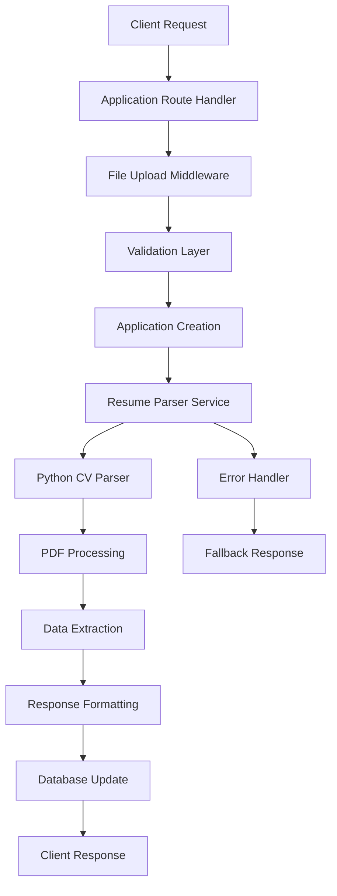

# Design Document

## Overview

The resume parsing enhancement addresses reliability issues in the existing CV parsing system. The current implementation has the right architecture but suffers from inconsistent parsing results, inadequate error handling, and missing validation. This design improves the robustness of the parsing pipeline while maintaining the existing API structure.

The system uses a Node.js backend that spawns a Python subprocess to parse PDF resumes using PyMuPDF. The parsed data is stored in MongoDB alongside the application data and returned to the client immediately upon successful parsing.

## Architecture

### Current Architecture Analysis
The existing system follows a solid architectural pattern:
- **API Layer**: Express.js routes handle HTTP requests
- **Service Layer**: Node.js service spawns Python parser subprocess  
- **Parser Layer**: Python script extracts data from PDF files
- **Data Layer**: MongoDB stores applications with parsed resume data

### Enhanced Architecture Components



## Components and Interfaces

### 1. Enhanced Validation Layer
**Purpose**: Validate file uploads and request data before processing
**Interface**:
```javascript
// Input validation
validateApplicationRequest(req) -> { isValid: boolean, errors: string[] }
validateResumeFile(file) -> { isValid: boolean, error?: string }
```

### 2. Improved Parser Service
**Purpose**: Robust resume parsing with better error handling and logging
**Interface**:
```javascript
parseResume(filePath: string) -> Promise<ParsedResumeData>
validateParsedData(data: any) -> ParsedResumeData
```

### 3. Enhanced Python Parser
**Purpose**: More reliable PDF text extraction and data parsing
**Key Improvements**:
- Better error handling for corrupted PDFs
- Improved text extraction fallbacks
- Enhanced data validation
- Structured logging

### 4. Response Formatter
**Purpose**: Ensure consistent API response format
**Interface**:
```javascript
formatApplicationResponse(application: Application) -> ApplicationResponse
```

## Data Models

### Enhanced ParsedResumeData Structure
```typescript
interface ParsedResumeData {
  name: string | null;
  email: string | null;
  phone: string | null;
  location: string | null;
  links: string[];
  skills: string[];
  summary: string | null;
  education: EducationEntry[];
  experience: ExperienceEntry[];
  certifications: string[];
  languages: string[];
  rawText: string;
  confidence: number; // 0.0 to 1.0
  parserVersion: string;
  parsedAt: string; // ISO date string
}

interface EducationEntry {
  institution: string | null;
  degree: string | null;
  field: string | null;
  startDate: string | null;
  endDate: string | null;
  grade: string | null;
}

interface ExperienceEntry {
  company: string | null;
  title: string | null;
  startDate: string | null;
  endDate: string | null;
  location: string | null;
  description: string | null;
}
```

## Error Handling

### Error Categories and Responses

1. **File Upload Errors**
   - Invalid file type → 400 Bad Request
   - File too large → 413 Payload Too Large
   - Corrupted file → 400 Bad Request

2. **Parsing Errors**
   - Python process timeout → Log error, continue with basic application
   - PDF extraction failure → Log error, continue with basic application
   - Invalid JSON response → Log error, continue with basic application

3. **Validation Errors**
   - Missing required fields → 400 Bad Request with specific field errors
   - Invalid job ID → 404 Not Found

### Error Handling Strategy
- **Graceful Degradation**: Application creation succeeds even if parsing fails
- **Comprehensive Logging**: All errors logged with context for debugging
- **User-Friendly Messages**: Clear error messages for client-side handling

## Testing Strategy

### Unit Tests
1. **Validation Functions**
   - Test file type validation
   - Test request data validation
   - Test parsed data validation

2. **Parser Service**
   - Test successful parsing scenarios
   - Test error handling scenarios
   - Test timeout handling

3. **Response Formatting**
   - Test complete data formatting
   - Test partial data formatting
   - Test error response formatting

### Integration Tests
1. **End-to-End Application Flow**
   - Test complete application submission with valid PDF
   - Test application submission with invalid file
   - Test application submission with parsing failure

2. **Python Parser Integration**
   - Test parser with various PDF formats
   - Test parser with corrupted files
   - Test parser timeout scenarios

### Test Data Requirements
- Sample PDF resumes with different layouts
- Corrupted PDF files for error testing
- Large files for size limit testing
- Various resume formats (different structures)

## Implementation Approach

### Phase 1: Enhanced Validation and Error Handling
- Improve file validation in upload middleware
- Add comprehensive request validation
- Enhance error logging and response formatting

### Phase 2: Parser Service Improvements
- Add data validation for parsed results
- Improve timeout handling
- Add retry logic for transient failures

### Phase 3: Python Parser Enhancements
- Improve PDF text extraction reliability
- Add better error handling for edge cases
- Enhance data extraction algorithms

### Phase 4: Testing and Monitoring
- Implement comprehensive test suite
- Add performance monitoring
- Create debugging tools for parsing issues

## Security Considerations

1. **File Upload Security**
   - Validate file types strictly
   - Scan for malicious content
   - Limit file sizes appropriately

2. **Process Security**
   - Isolate Python parser process
   - Limit parser execution time
   - Validate all parser outputs

3. **Data Security**
   - Sanitize extracted text data
   - Validate email and phone formats
   - Prevent injection attacks through parsed data

## Performance Considerations

1. **Parsing Performance**
   - Optimize PDF text extraction
   - Cache parsing results when appropriate
   - Implement async processing for large files

2. **Database Performance**
   - Index frequently queried fields
   - Optimize parsed data storage structure
   - Consider data compression for large text fields

3. **API Performance**
   - Return responses quickly even during parsing
   - Implement proper timeout handling
   - Add request rate limiting