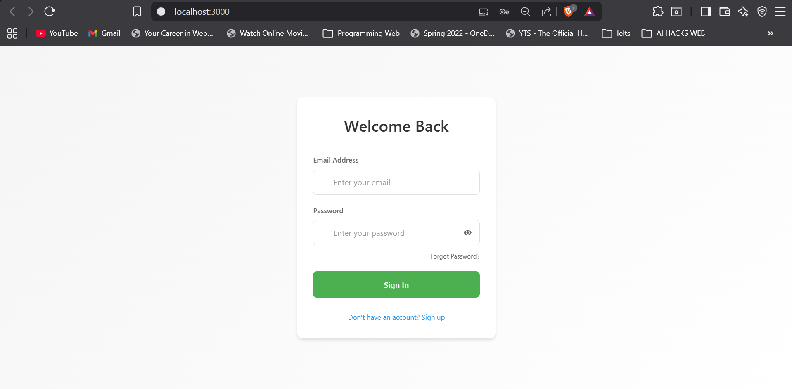
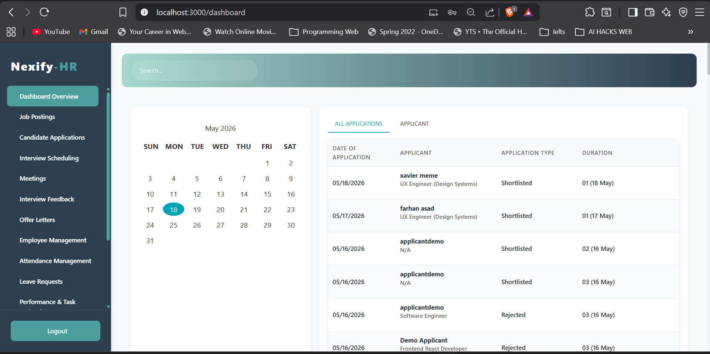
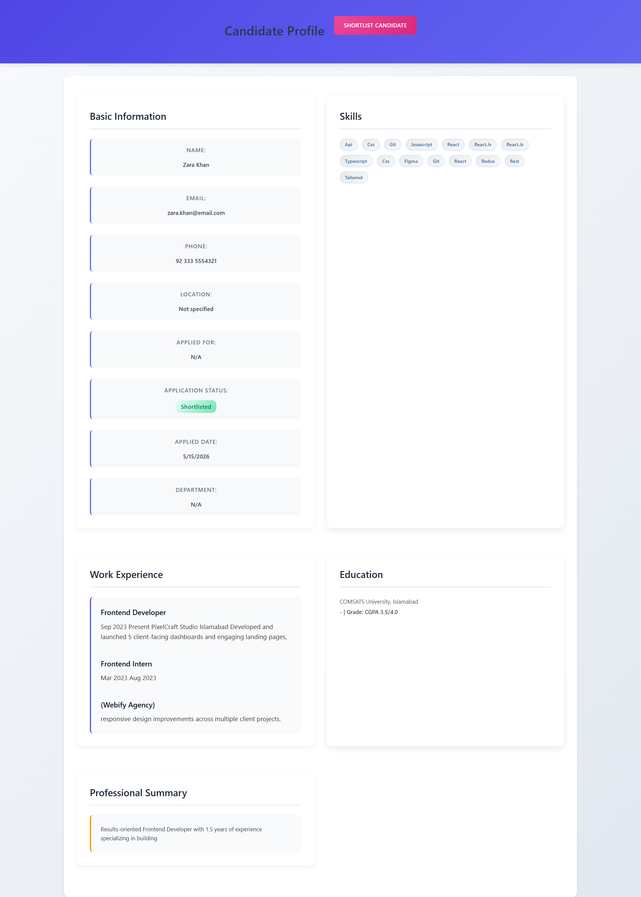
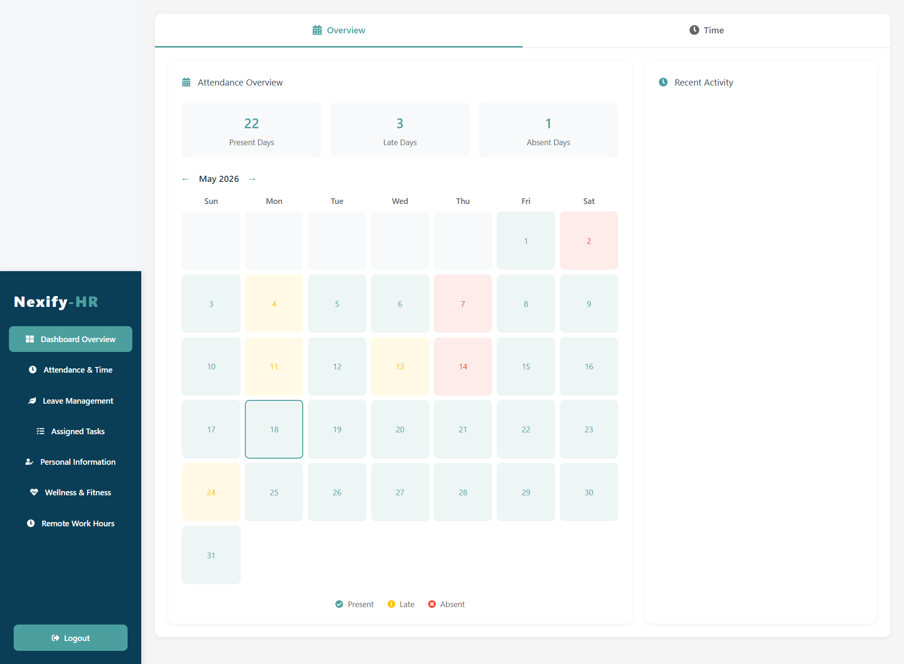
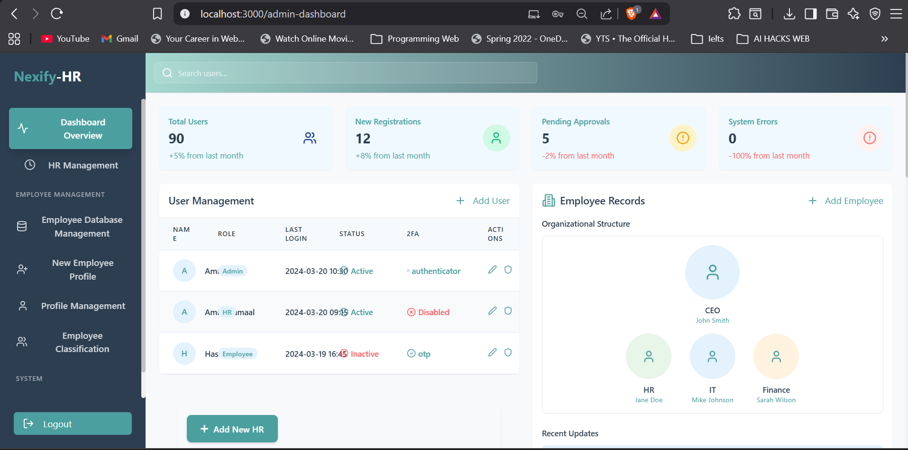
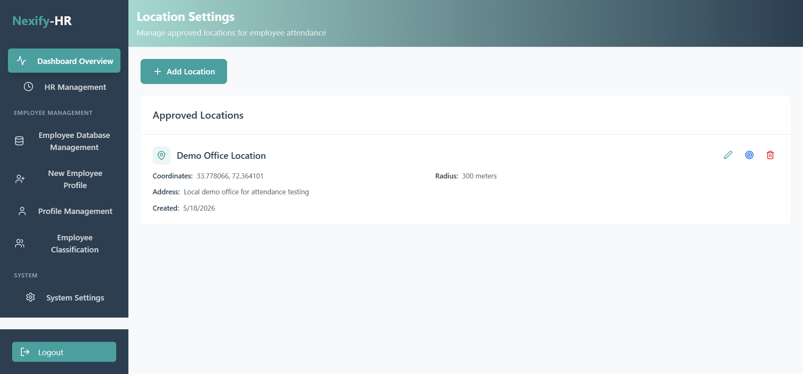

# Nexify HR

Nexify HR is a full-stack MERN HR management and recruitment portal built for recruitment, employee management, attendance tracking, role-based dashboards, and HR operations.

The project includes separate workflows for Applicants, HR, Employees, and Admin users. It supports job posting, resume-based applications, candidate review, interview scheduling, offer letters, employee onboarding, attendance, leave requests, task tracking, payroll-related modules, wellness features, remote work tracking, and admin-controlled office location settings.

## Live Demo

- Frontend: https://nexify-hr.vercel.app/
- Backend API Health Check: https://nexify-hr-backend.onrender.com/health

Note: The backend is hosted on Render, so the first request may take a short time if the service is waking up.

## Screenshots

### Login Page

### HR Dashboard

### Candidate Profile

### Employee Attendance

### Admin Dashboard

### Admin Location Settings

## Core Features

- Role-based authentication and dashboard routing
- Applicant registration and job application flow
- Resume upload and parsed resume data storage
- HR candidate review and application management
- Interview scheduling and feedback management
- Offer letter generation workflow
- Employee profile and record management
- Employee attendance check-in/check-out using browser geolocation
- Admin office location and attendance radius configuration
- Leave request management
- Task assignment and tracking
- Payroll and payslip-related modules
- Wellness and remote work support
- Environment-based frontend/backend configuration for deployment

## User Roles

### Applicant

- Register as an applicant
- Browse job postings
- Apply for jobs with resume upload
- Track application status
- Receive interview and offer-related updates

### HR

- Create and manage job postings
- Review candidate applications
- Shortlist candidates
- Schedule interviews
- Send offer letters
- Manage employees
- Review attendance and leave requests
- Manage tasks, payroll-related flows, wellness, and work-hour tracking

### Employee

- View employee dashboard
- Check in and check out using browser geolocation
- Submit leave requests
- Manage personal information
- Track assigned tasks
- Use wellness and remote work features

### Admin

- Access protected admin dashboard
- Manage admin-only settings
- Configure approved office locations
- Set office attendance radius for geolocation-based attendance

## Professional Role Flow

For security reasons, users do not select their own role during public registration.

Public registration creates an Applicant account by default. HR/Admin users manage role transitions after recruitment, approval, or onboarding.

Typical workflow:

1. Applicant registers.
2. Applicant applies for a job.
3. HR reviews the application.
4. HR shortlists the candidate.
5. HR schedules an interview.
6. HR sends an offer letter.
7. Candidate is onboarded as an employee.
8. Employee logs in and is redirected to the Employee Dashboard.

## Security Improvements

- Added protected admin routing on the frontend
- Protected backend admin routes with authentication and admin authorization
- Added admin role support in backend user role validation
- Replaced plain-text password comparison with bcrypt password hashing
- Added backward-compatible legacy password upgrade
- Existing plain-text users can still log in
- After successful login, their password is automatically upgraded to a bcrypt hash
- Moved API and email configuration to environment variables
- Prevented direct non-admin access to protected admin pages

## Tech Stack

### Frontend

- React.js
- React Router
- Axios
- Styled Components
- React Icons

### Backend

- Node.js
- Express.js
- MongoDB
- Mongoose
- JWT Authentication
- bcryptjs
- Nodemailer
- Multer
- Python-based resume parsing support

### Deployment

- Frontend deployed on Vercel
- Backend deployed on Render
- Database hosted on MongoDB Atlas
- Local MongoDB data migrated to Atlas using MongoDB Database Tools

## Environment Variables

Create a `.env` file inside the `server` folder for local backend development.

Example server variables:

- MONGODB_URI=mongodb://localhost:27017/job-portal
- PORT=5000
- NODE_ENV=development
- JWT_SECRET=replace_with_your_jwt_secret
- EMAIL_USER=your_email@gmail.com
- EMAIL_PASSWORD=your_gmail_app_password
- EMAIL_FROM_ADDRESS=your_email@gmail.com
- EMAIL_FROM_NAME=Nexify HR
- SMTP_HOST=smtp.gmail.com
- SMTP_PORT=587
- PYTHON_BIN=python
- CV_PARSE_TIMEOUT_MS=15000

For deployed frontend, set:

- REACT_APP_API_URL=https://nexify-hr-backend.onrender.com/api

Do not commit real `.env` secrets to GitHub.

## Installation

### Backend

Run these commands:

- cd server
- npm install
- npm start

Backend runs locally on:

- http://localhost:5000

### Frontend

Run these commands:

- cd client
- npm install
- npm start

Frontend runs locally on:

- http://localhost:3000

## Build

Run:

- cd client
- npm run build

## Deployment Notes

- Backend uses `npm start`, which runs `node server.js`.
- Frontend uses `REACT_APP_API_URL` to connect to the deployed backend.
- Render provides the production backend port automatically.
- MongoDB Atlas is used for deployed database storage.
- The deployed backend health route is available at `/health`.

## Notes

- Use Chrome for geolocation-based attendance testing.
- Attendance requires approved office locations and radius setup from Admin Location Settings.
- Gmail email sending requires a Gmail App Password, not a normal Gmail password.
- Resume parsing depends on local Python parser dependencies.
- Some dashboard analytics/widgets may still contain demo/static values and can be improved further for production use.

## My Contribution

This project was completed as a Final Year Project. My major work included:

- Stabilizing and testing the full MERN project
- Connecting HR, Applicant, Employee, and Admin dashboard flows
- Configuring secure role-based routing
- Adding protected admin role support
- Fixing admin dashboard logout behavior
- Moving email sender configuration to environment variables
- Connecting parsed resume data with job applications
- Improving candidate profile behavior
- Fixing attendance geolocation check-in/check-out flow
- Adding admin-controlled office location/radius support for attendance
- Preparing the frontend for Vercel deployment
- Preparing the backend for Render deployment
- Migrating local MongoDB data to MongoDB Atlas
- Adding backend health check routes
- Upgrading authentication from plain-text password comparison to bcrypt hashing
- Testing deployed login and HR dashboard data loading from the cloud database
- Preparing the project for GitHub portfolio presentation

## Status

This project is functional for local demo, academic evaluation, deployed demonstration, and portfolio presentation.

Some modules can be further improved for production use, including deeper analytics, complete email provider migration, advanced admin controls, and additional automated tests.

## License

This project is for academic and portfolio purposes.
