# Nexify-HR

Nexify-HR is a full-stack HR and job portal built as a portfolio-quality MERN-style project. It demonstrates role-based hiring workflows across Applicant, HR, Employee, and Admin users, with secure authentication, protected dashboards, resume upload support, and seeded demo data for quick review.

This project is intended to be run locally for evaluation. There is no live deployment URL yet.

## Highlights

- Role-based dashboards for Applicant, HR, Employee, and Admin users.
- Secure authentication with JWT sessions and bcryptjs password hashing.
- Protected frontend routes with role-based redirects.
- Logout and browser Back-button protection for dashboard pages.
- Applicant job browsing, job details, application submission, and application tracking.
- HR recruitment screens for job postings, candidate applications, interviews, feedback, and offers.
- Employee dashboard screens for attendance, leave, self-service, payroll, and remote-work views.
- Admin dashboard screens for HR approvals and user/role management.
- Resume upload support with Python resume parser integration available in the backend.
- Seeded demo users and sample jobs for local review.

## Screenshots

| Login                                   | Register                                      |
| --------------------------------------- | --------------------------------------------- |
| 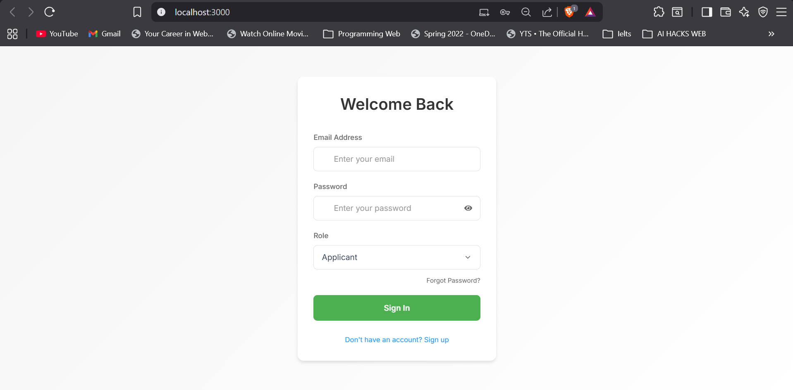 | 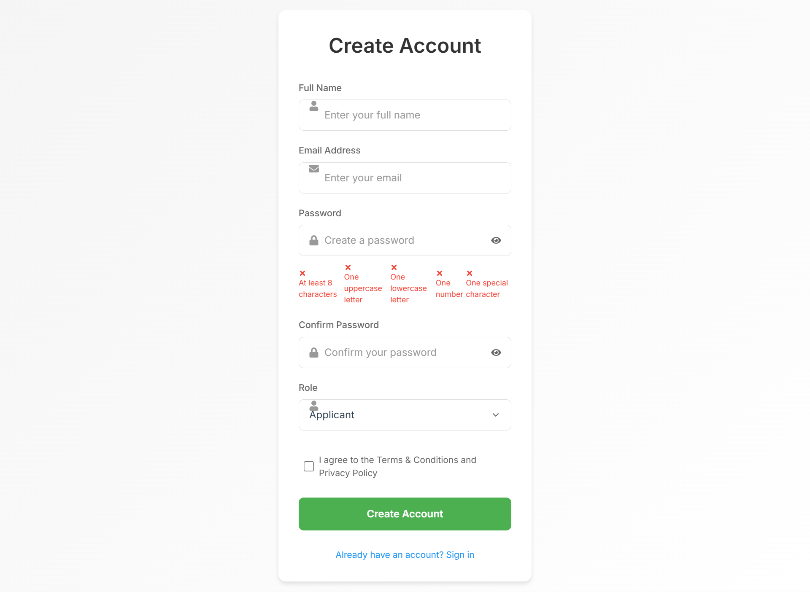 |

| Applicant Dashboard                                                 | Browse Jobs                                         |
| ------------------------------------------------------------------- | --------------------------------------------------- |
| 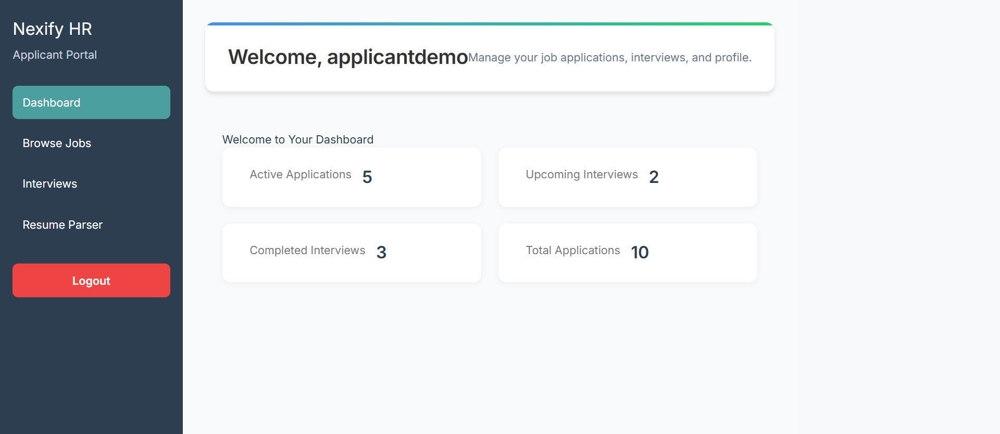 | 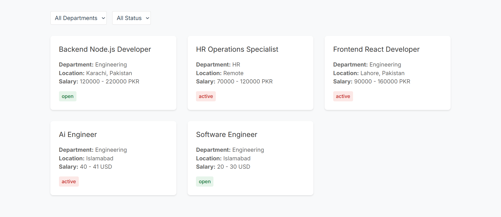 |

| Job Details                                         | Application Form                                              |
| --------------------------------------------------- | ------------------------------------------------------------- |
| 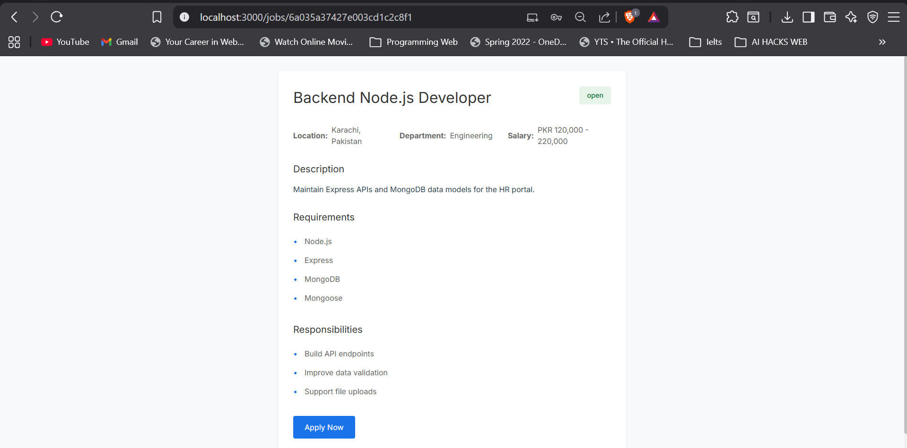 | 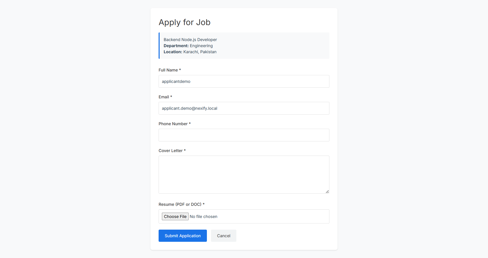 |

| Applications List                                               | HR Dashboard                                          |
| --------------------------------------------------------------- | ----------------------------------------------------- |
| 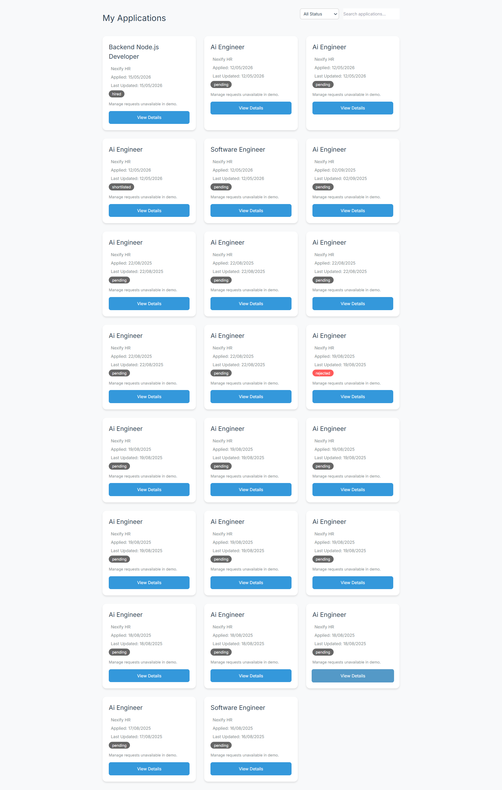 | 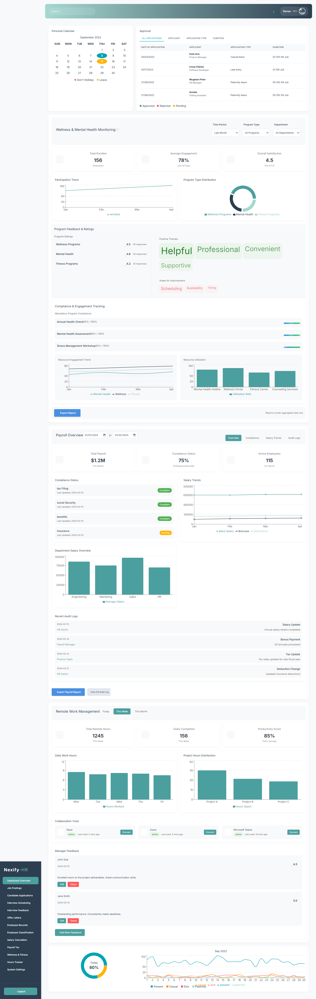 |

| HR Job Postings                                             | Employee Dashboard                                                |
| ----------------------------------------------------------- | ----------------------------------------------------------------- |
| 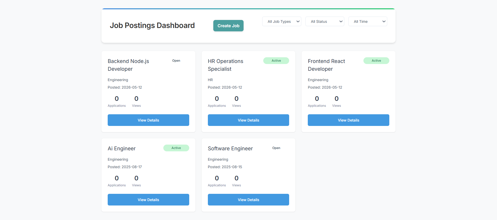 | 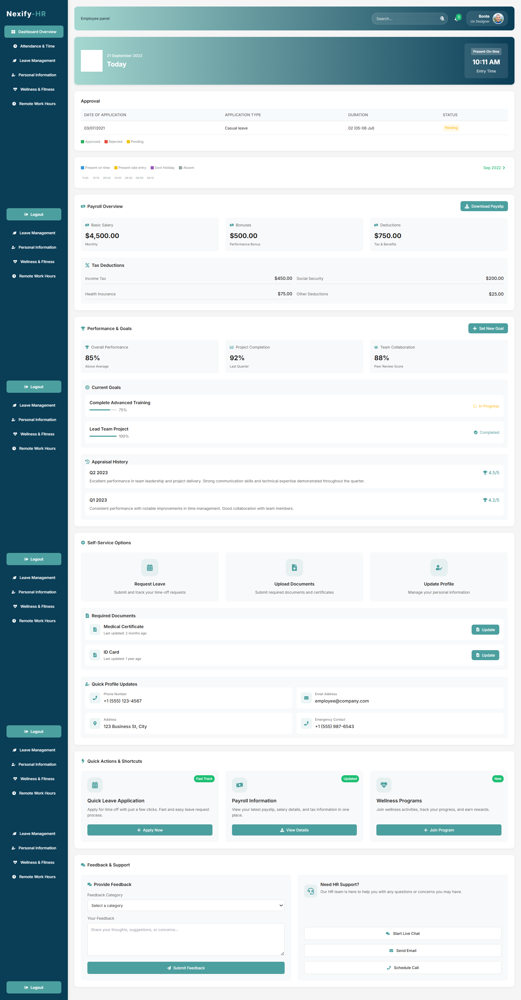 |

| Admin Dashboard                                             |
| ----------------------------------------------------------- |
| 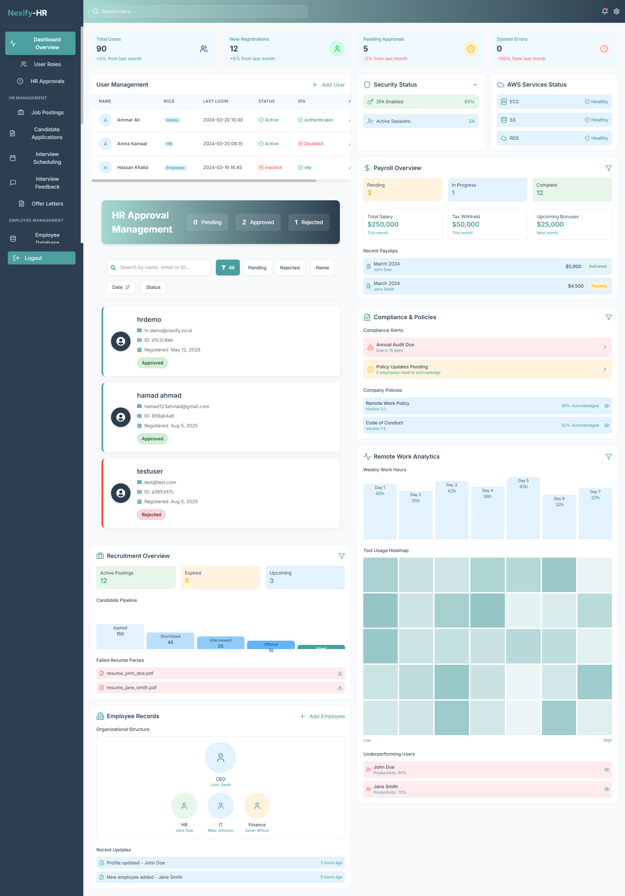 |

## Features By Role

### Applicant

- Register and log in as an applicant.
- View the applicant dashboard.
- Browse available jobs.
- Open job details.
- Submit an application with resume upload.
- View submitted applications.
- Open local application details from the applications page.

### HR

- Access HR dashboard screens.
- Create and review job postings.
- View recruitment pipeline screens.
- Review candidate application management UI.
- Use interview scheduling, feedback, and offer letter screens.

### Employee

- Access the employee dashboard.
- View attendance and leave screens.
- View self-service personal information screen.
- Access payroll, wellness, and remote-work hour tracking screens.

### Admin

- Access the admin dashboard.
- Review HR approval screens.
- Access user roles and permissions screens.
- Navigate across administrative HR, employee, payroll, and analytics sections.

## Security

- Passwords are hashed with `bcryptjs` before storage.
- Login verifies passwords with bcrypt comparison.
- JWT authentication is used for backend auth responses.
- Frontend dashboards are protected by role guards.
- Unauthenticated users are redirected to `/login`.
- Wrong-role users are redirected to their own dashboard.
- Logout clears stored auth state.
- Browser Back after logout no longer exposes protected dashboard pages.

## Tech Stack

### Frontend

- React 18
- Create React App
- React Router
- Axios
- Styled Components
- Framer Motion

### Backend

- Node.js
- Express
- MongoDB
- Mongoose
- JWT auth
- bcryptjs
- Multer resume uploads
- Python resume parser integration

### Resume Parser

- Python service scripts under `server/services`
- PyMuPDF
- python-docx
- pdfminer.six
- pdf2image
- pytesseract

## Project Structure

```text
Nexify-HR/
  client/                 React frontend
  server/                 Express API, MongoDB models, uploads, parser services
  server/scripts/         Seed and helper scripts
  server/services/        Python resume parser support
  docs/screenshots/       Project screenshots
  TESTING.md              Manual testing guide
  README.md               Project overview and setup
```

## Local Setup

### Requirements

- Node.js and npm
- MongoDB running locally or a MongoDB connection string
- Python 3 with pip, only if testing resume parser dependencies

### Clone

```bash
git clone https://github.com/muneeb123469/Nexify-HR.git
cd Nexify-HR
```

### Backend Setup

```bash
cd server
npm install
copy .env.example .env
npm run seed
npm start
```

Backend runs at:

```text
http://localhost:5000
```

API routes are mounted under:

```text
/api
```

### Frontend Setup

Open a second terminal:

```bash
cd client
npm install
copy .env.example .env
npm start
```

Frontend runs at:

```text
http://localhost:3000
```

## Environment Variables

### Backend `.env`

```env
PORT=5000
MONGODB_URI=mongodb://localhost:27017/job-portal
JWT_SECRET=replace_with_secure_secret
NODE_ENV=development
CV_PARSE_TIMEOUT_MS=30000
PYTHON_BIN=python
```

### Frontend `.env`

```env
REACT_APP_API_URL=http://localhost:5000/api
```

## Demo Accounts

Seed the database first:

```bash
cd server
npm run seed
```

All demo accounts use this password:

```text
Demo@12345
```

| Role      | Email                         |
| --------- | ----------------------------- |
| Applicant | `applicant.demo@nexify.local` |
| HR        | `hr.demo@nexify.local`        |
| Employee  | `employee.demo@nexify.local`  |
| Admin     | `admin.demo@nexify.local`     |

## Resume Parser Setup

The application can submit resumes without requiring parser setup, but parser testing requires Python dependencies:

```bash
cd server
python -m pip install --upgrade pip
python -m pip install -r services/requirements.txt
python -c "import fitz, docx, pdfminer.high_level, pdf2image, pytesseract; print('parser deps ok')"
```

`PYTHON_BIN` can be set in `server/.env` if your Python executable is not available as `python`.

## Testing

Manual testing notes are documented in [TESTING.md](TESTING.md).

Recommended local review flow:

1. Start MongoDB.
2. Run `cd server && npm run seed`.
3. Start the backend with `npm start`.
4. Start the frontend with `cd client && npm start`.
5. Log in with each demo role and verify dashboard access.
6. As Applicant, browse jobs, open details, submit an application, and view the applications page.

## Current Limitations And Future Improvements

- Reduce remaining ESLint warnings.
- Add automated frontend and backend tests.
- Complete a final full-app dead-action walkthrough.
- Add deployment and a short demo video.
- Polish resume parser UI and error states if needed.
- Replace remaining mock dashboard sections with real persisted data.

## Notes For Reviewers

Nexify-HR is not presented as fully production-ready. It is a local portfolio project focused on demonstrating practical full-stack implementation, secure auth improvements, role-based access control, recruiter-facing workflows, and clear project documentation.
